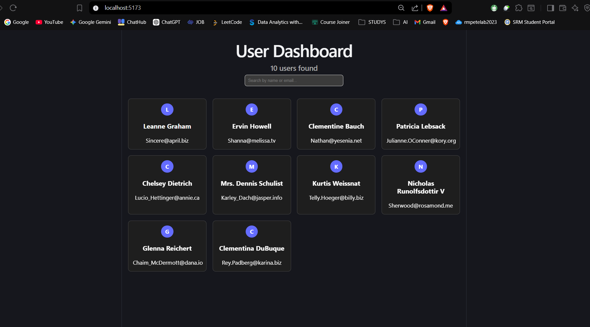
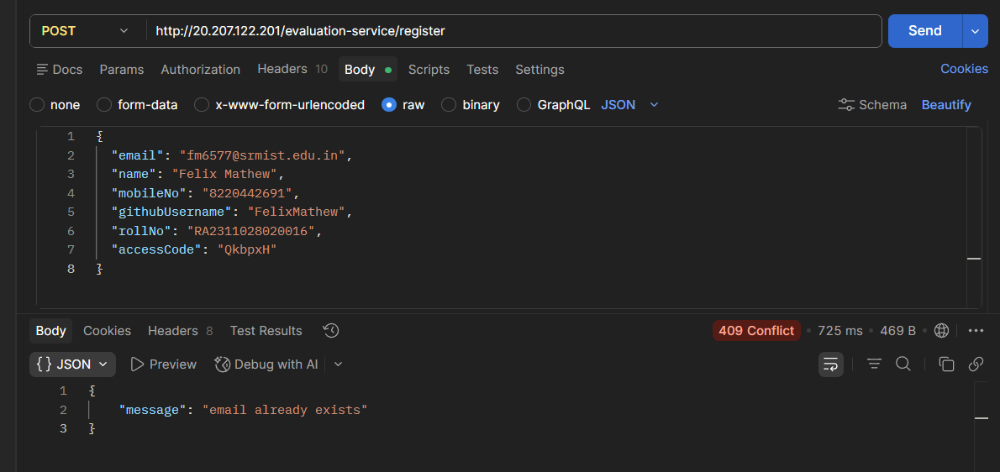

#  User Dashboard with Logging Middleware

##  Project Structure

```
ROOT/
├── logging_middleware/
│   └── log.ts
│
├── notification_app_fe/
│   ├── src/
│   ├── public/
│   ├── package.json
│   ├── vite.config.ts
│
├── screenshots/
├── notification_system_design.md
├── README.md
└── .gitignore
```

---

### 2️⃣ Install dependencies

```bash
cd notification_app_fe
npm install
```

### 3️⃣ Run the application

```bash
npm run dev
```

---

##  Screenshots

<h3> User Dashboard UI</h3>


<h3>API Logs (Postman)</h3>

---

## Logging Middleware

A reusable logging function is implemented to send logs to the evaluation server.

### Example:

```ts
Log("frontend", "info", "component", "Users fetched successfully");
```

---

